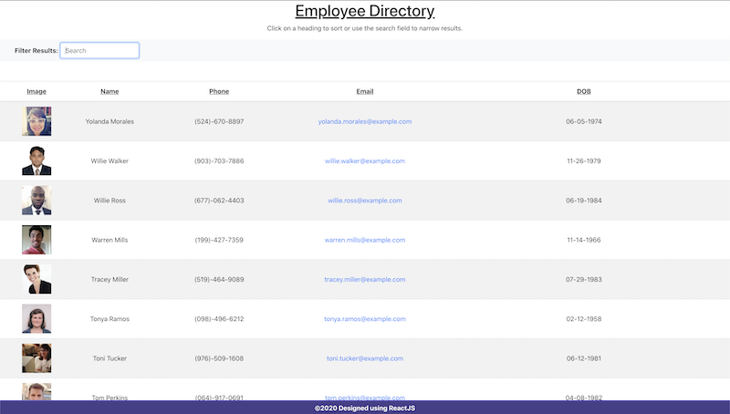

# Employee Directory

## Introduction
An Employee Directory built using React. This demonstration uses a randomly generated field of users (instead of real people) to populate the table.
 

 
Gif of app functionality

 

## Technologies used
* HTML
* CSS
* JavaScript
* React
* Bootstrap
* Axios

 

## Usage
The Employee Directory application can be used to create and view a data table of employees and non-sensitive information. The application also allows for sorting data and filtering results.

 

## Screenshots

 
Screenshot of application
 
 

## Contact Information
If you have any questions about the application or contributions, I can be contacted via email at: <masonmcginely32@gmail.com>
 
